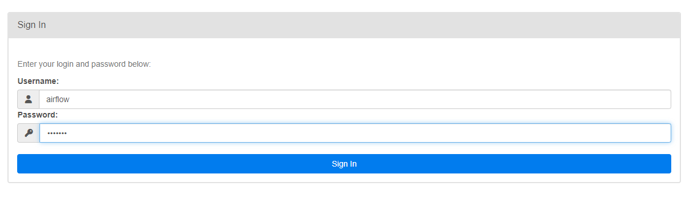
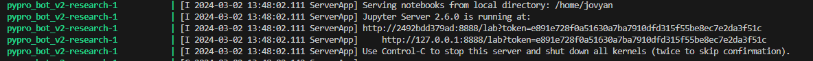
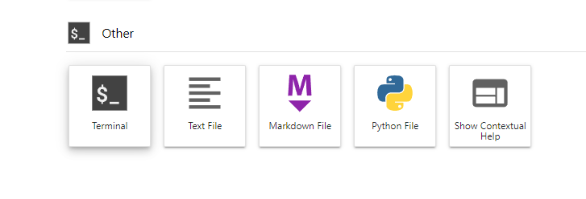
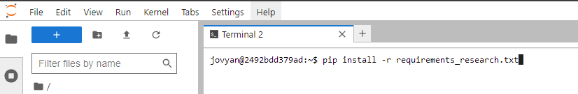

<!-- Improved compatibility of back to top link: See: https://github.com/othneildrew/Best-README-Template/pull/73 -->
<a name="readme-top"></a>
<!--
*** Thanks for checking out the Best-README-Template. If you have a suggestion
*** that would make this better, please fork the repo and create a pull request
*** or simply open an issue with the tag "enhancement".
*** Don't forget to give the project a star!
*** Thanks again! Now go create something AMAZING! :D
-->


<!-- PROJECT SHIELDS -->
<!--
*** I'm using markdown "reference style" links for readability.
*** Reference links are enclosed in brackets [ ] instead of parentheses ( ).
*** See the bottom of this document for the declaration of the reference variables
*** for contributors-url, forks-url, etc. This is an optional, concise syntax you may use.
*** https://www.markdownguide.org/basic-syntax/#reference-style-links
-->


<!-- PROJECT LOGO -->
<br />
<div align="center">
  <a href="https://www.pypro.mx/app/inicio/">
    
  </a>

  <h3 align="center">PyPro Bot v2</h3>

  <p align="center">
    Este repositorio contiene el stack de trabajo para implementar e investigar estrategias de trading algorítmico es un upgrade al repositorio anterior (link abajo) donde se actualiza el docker-compose y se agrega el servicio de "research" un ambiente de jupyter notebook para poder investigar estrategias de trading. Se centra en la replicabilidad de estrategias e investigación para dar soporte a los videos de youtube del canal de PyPro.
    <br />
    <a href="https://www.pypro.mx/app/inicio/"><strong>Explora más cursos »</strong></a>
    <br />
    <br />
    <a href="https://discord.gg/aBR3wMp">Discord</a>
    ·
    <a href="https://www.youtube.com/@pypro">Youtube</a>
    ·
    <a href="https://twitter.com/Cryptomonkey01">Twitter</a>
    ·
    <a href="https://www.instagram.com/pypromx/">Instagram</a>
    ·
    <a href="https://www.tiktok.com/@pypromx">TikTok</a>
    ·
    <a href="https://www.linkedin.com/in/guillermo-izquierdo-colin-09586a49/">LinkedIn</a>
  </p>

  <a href="https://www.buymeacoffee.com/pypro">
    
  </a>
</div>


<!-- ABOUT THE PROJECT -->
## Acerca del Proyecto


El objetivo principal de este repositorio es proporcionar una guía completa y actualizada sobre una plataforma de trading productiva, se implementan tecnologías como Apache Airflow, Jupyter Notebook entre otras para hacer un proyecto replicable y al alcance de todos.

Este proyecto es una segunda versión del [Curso Trading Algoritmico](https://github.com/memonkey01/pypro_bot)


<p align="right">(<a href="#readme-top">volver al inicio</a>)</p>


<!-- GETTING STARTED -->
## Empezando con PyPro

Para usar este repositorio tendrás que tener instalado Docker

### Descarga de Software

Esta es una lista del software que necesitas para el proyecto.

1. Docker. [Descarga](https://www.docker.com/products/docker-desktop/)
2. Git para controlar versiones de código. [Descarga](https://git-scm.com/downloads)
3. VsCode para editar texto. [Descarga](https://code.visualstudio.com/download)
4. DBeaver para consultar nuestra base de datos [Descarga](https://dbeaver.io/download/)

### Instalación

_Instala Docker, Git y VsCode._

Clonar repositorio de Github
```bash
  git clone https://github.com/memonkey01/pyprobot_v2.git
  cd pyprobot_v2
```
Instalar ambiente usando Docker (recuerda que tienes que tener abierto Docker Desktop)
```bash
  docker-compose build 
  docker-compose up
```
<!-- USAGE EXAMPLES -->
## Uso

El uso se puede dividir en dos secciones.

- Motor de Trading (Apache Airflow): http://127.0.0.1:8888/ (user and pass = airflow)




- Jupyter Notebooks:  http://127.0.0.1:8888/   (recuerda que debes de acceder con el token que se imprime en tu consola)



####  Una vez dentro de Jupyter Notebook


#### Abrir una terminal


```bash
  pip install -r requirements_research.txt
```

<p align="right">(<a href="#readme-top">volver al inicio</a>)</p>


<!-- CONTACT -->
## Contacto

Cryptomonkey - [@Cryptomonkey01](https://twitter.com/Cryptomonkey01) 

PyPro Website: [https://www.pypro.mx](https://www.pypro.mx/app/inicio/)

Repositorio Git: [https://github.com/memonkey01/cursos_pypro](https://github.com/memonkey01/cursos_pypro)


<p align="right">(<a href="#readme-top">volver al inicio</a>)</p>

